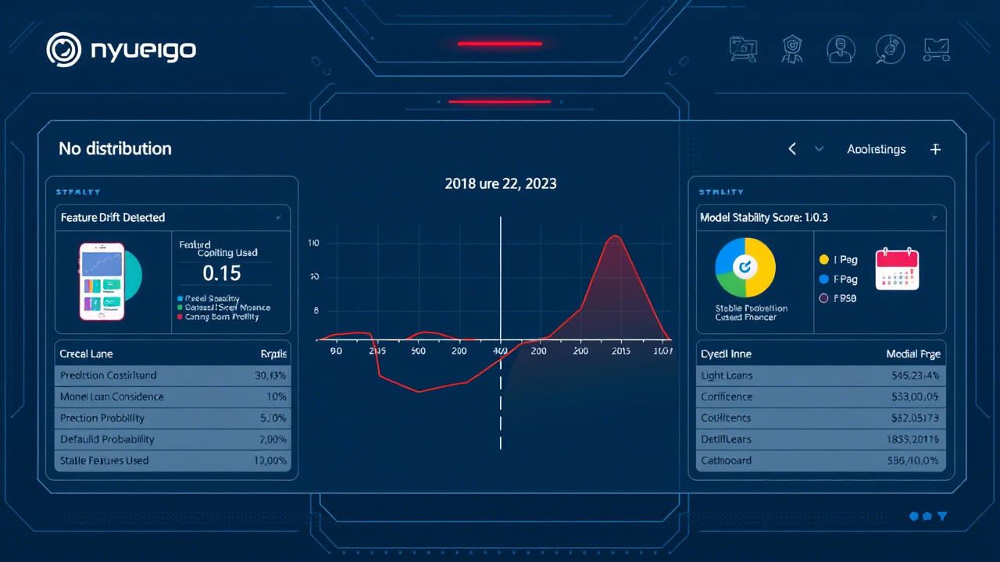

# Home Credit Risk Model Pipeline

 <!-- Replace with actual image if available -->

## Introduction

This project provides a comprehensive approach to building and assessing credit risk models. It leverages various machine learning algorithms, including **LightGBM** and **CatBoost**, combined with ensemble techniques for robust predictions. The pipeline emphasizes data integrity, feature relevance, and model stability — crucial elements in credit risk assessment.

It was originally inspired by the [Home Credit Default Risk Kaggle competition](https://www.kaggle.com/c/home-credit-default-risk), and has been adapted into a modular and reusable framework suitable for real-world applications.

>  **Created by**: [Zulqarnain Ali](https://www.linkedin.com/in/zulqarnainalipk/) – Feel free to connect or contribute!

---

## Table of Contents

- [Overview](#overview)
- [Features](#features)
- [Project Structure](#project-structure)
- [Setup and Installation](#setup-and-installation)
- [Usage](#usage)
- [Data](#data)
- [Models](#models)
- [Contributing](#contributing)
---

## Overview

This project is designed to streamline the end-to-end process of developing credit risk prediction models. It includes modules for:

- Data preprocessing and cleaning
- Feature engineering and aggregation
- Ensemble modeling using multiple ML algorithms
- Predictive inference on new datasets

The goal is to provide a production-ready pipeline that can be extended and integrated into financial systems for decision support.

---

## Features

✅ **Data Preprocessing**:  
Includes handling missing values, type conversion, memory optimization, and filtering logic for efficient computation.

✅ **Feature Engineering**:  
Extracts meaningful insights from raw data using aggregation and transformation techniques to enhance predictive power.

✅ **Model Training**:  
Supports training of advanced machine learning models like LightGBM and CatBoost to capture complex patterns.

✅ **Ensemble Learning**:  
Combines predictions from multiple models using a custom Voting Model to improve accuracy and reduce overfitting.

✅ **Modular Design**:  
Code is structured into distinct, reusable components for better maintainability and scalability.

---

## Project Structure

```
home-credit-risk-model/
├── src/
│   ├── __init__.py
│   ├── data_preprocessing.py    # Contains data cleaning, type conversion, and filtering logic
│   ├── feature_aggregation.py   # Handles feature aggregation from various data sources
│   ├── data_loader.py           # Functions for reading single and multiple parquet files
│   ├── feature_engineering.py   # Combines and engineers features from different data depths
│   ├── utils.py                 # Utility functions like memory reduction and pandas conversion
│   └── ensemble_model.py        # Custom VotingModel for ensemble predictions
├── data/                        # Placeholder for raw and processed data (e.g., parquet files)
├── models/                      # Placeholder for trained machine learning models
├── notebooks/                   # Original Jupyter notebooks and exploratory analysis
├── .gitignore                   # Specifies intentionally untracked files to ignore
├── requirements.txt             # Lists project dependencies
└── README.md                    # Project overview and documentation
```

---

## Setup and Installation

To set up the project locally, follow these steps:

1. **Clone the repository:**
   ```bash
   git clone https://github.com/your-username/home-credit-risk-model.git
   cd home-credit-risk-model
   ```

2. **Create a virtual environment (recommended):**
   ```bash
   python -m venv venv
   source venv/bin/activate  # On Windows use `venv\Scripts\activate`
   ```

3. **Install dependencies:**
   ```bash
   pip install -r requirements.txt
   ```

---

## Usage

This project supports two primary modes: `train` and `predict`. These are managed via the `main_pipeline.py` script.

### 🛠 Training Mode

In training mode, the pipeline processes raw data, performs feature engineering, and prepares it for model training.

```bash
python -c "from src.main_pipeline import run_pipeline; run_pipeline(mode='train')"
```

> ⚠️ Note: The actual model training logic is currently commented out in `main_pipeline.py`. To train new models, you can enable this section or refer to the original notebook inside the `notebooks/` directory.

If pre-trained models are missing, you can retrain them using the provided Jupyter notebook:
```text
notebooks/train_home_credit_risk_model.ipynb
```

###  Prediction Mode

In prediction mode, the pipeline loads pre-trained models, processes new test data, and generates final predictions.

```bash
python -c "from src.main_pipeline import run_pipeline; run_pipeline(mode='predict')"
```

> 💡 Ensure that all required `.joblib` model files and `notebook_info.joblib` are present in the `/kaggle/input/homecredit-models-public/` directory. You may need to adjust the `ROOT` path in `main_pipeline.py` for local execution.

---

## Data

The pipeline expects input data in **Parquet format**, organized under the following directories:

- `parquet_files/train/`
- `parquet_files/test/`

These paths can be customized by updating the `TRAIN_DIR`, `TEST_DIR`, and `ROOT` variables in `src/main_pipeline.py`.

---

## Models

Pre-trained models (`LightGBM`, `CatBoost`) are loaded as `.joblib` files during prediction. If they're not available, you can always retrain them using the provided notebook:

```text
notebooks/train_home_credit_risk_model.ipynb
```

This notebook contains the full training loop and model persistence logic, allowing you to regenerate models locally.

---

## Contributing

Contributions are welcome! Whether you'd like to fix bugs, add features, or improve documentation — feel free to open an issue or submit a pull request.

---

>  **Created by**: [Zulqarnain Ali](https://www.linkedin.com/in/zulqarnainalipk/) – Feel free to connect or contribute!
